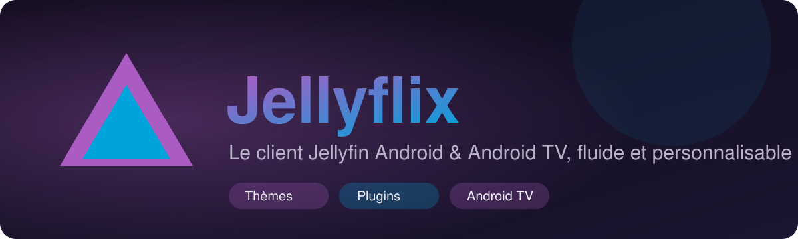

<p align="center">
  
</p>

<p align="center">
  <a href="https://github.com/peterdu1109/Jellyflix/releases/latest"></a>
  <a href="https://github.com/peterdu1109/Jellyflix/releases"></a>
  <a href="https://github.com/peterdu1109/Jellyflix/actions/workflows/build.yml"></a>
  
  
</p>

<p align="center">
  <a href="#-télécharger">Télécharger</a> ·
  <a href="#-fonctionnalités">Fonctionnalités</a> ·
  <a href="#-thèmes">Thèmes</a> ·
  <a href="#-plugins">Plugins</a> ·
  <a href="#-compiler">Compiler</a>
</p>

---

**Jellyflix** est un client [Jellyfin](https://jellyfin.org) natif pour **Android** et **Android TV** (un seul APK).
Il reprend l'essentiel de l'app officielle, mais avec un design moderne, des **thèmes** et un système de **plugins** pour l'adapter à vos goûts.

## 📥 Télécharger

1. Ouvrez la page des **[Releases](https://github.com/peterdu1109/Jellyflix/releases/latest)** et téléchargez le fichier `Jellyflix-vX.Y.Z.apk`.
2. **Téléphone** : ouvrez l'APK et autorisez l'installation depuis cette source.
3. **Android TV** : installez l'app *Downloader* et saisissez l'adresse de l'APK, ou envoyez le fichier avec *Send Files to TV*.
4. Lancez Jellyflix, entrez l'adresse de votre serveur, connectez-vous (mot de passe ou **Quick Connect**).

> Prérequis : Android 8.0 ou plus, serveur Jellyfin 10.10 ou plus récent.

Une nouvelle release est publiée **automatiquement** à chaque nouvelle version poussée sur `main`.

## ✨ Fonctionnalités

| | |
|---|---|
| 🔐 **Connexion** | Détection de l'adresse (http/https, port), mot de passe, Quick Connect, plusieurs comptes |
| 🌐 **Interface du serveur** | Par défaut, l'app affiche **l'interface web de votre Jellyfin elle-même**, connectée automatiquement : même thème, même CSS personnalisé, mêmes plugins (Media Bar, Home Screen Sections, JavaScript Injector…), avec la disposition TV du client web sur Android TV. Bascule vers l'interface native dans Réglages → Interface, ou via le menu (touche Menu de la télécommande, ou Retour à la racine) |
| 🪞 **Fidèle au serveur** (interface native) | Reprend l'organisation configurée sur Jellyfin : ordre des sections d'accueil, bibliothèques masquées ou réordonnées, thème du serveur, pistes audio et sous-titres par défaut, pastilles « non vus » |
| 🏠 **Accueil** | Reprendre la lecture / l'écoute, À suivre, Télé en direct, Derniers ajouts par bibliothèque, Favoris |
| 📚 **Bibliothèques** | Grille paginée, tri, contenu adapté au type (films, séries, musique, playlists, collections) |
| 🎬 **Fiches** | Films, séries, saisons, épisodes, distribution et filmographie, similaires, vu / favori |
| ⬇️ **Hors-ligne** | Téléchargement de films, épisodes et saisons entières, reprise après coupure, Wi‑Fi uniquement (réglable), lecture sans réseau, progression renvoyée au serveur au retour du réseau |
| 🎵 **Musique** | Albums, artistes, titres, playlists, lecture en arrière-plan avec notification et contrôles écran verrouillé, file d'attente, aléatoire, répétition |
| 📡 **Télé en direct** | Chaînes avec programme en cours, enregistrements, libération du tuner à la fermeture |
| 📺 **Chromecast** | Diffusion depuis le lecteur vidéo (transcodage H.264/AAC par le serveur) |
| 🔎 **Recherche** | Instantanée, sans requêtes inutiles |
| ▶️ **Lecteur** | Lecture directe ou transcodage automatique, pistes audio et sous-titres sans perdre la position, qualité, reprise, épisode suivant |
| ⏭️ **Passer l'intro** | Intro / générique / résumé via les segments du serveur (compatible *Intro Skipper*) |
| 📱 **Android TV** | Navigation complète à la télécommande, menu latéral, focus bien visible |

**Sous le capot** : le profil de l'appareil est construit à partir de ses vrais décodeurs (HEVC, VP9, AV1, AC3…) pour ne transcoder que si nécessaire, avec repli automatique si la lecture directe échoue. La progression est renvoyée au serveur.

## 🎨 Thèmes

Réglages → Apparence :

| Thème | Accent |
|---|---|
| **Jellyfin** | violet / bleu |
| **Ocean** | bleu / turquoise |
| **Forest** | vert |
| **Sunset** | orange |
| **Rose** | rose / mauve |
| **Mono** | gris |

**Thème du serveur** : par défaut, Jellyflix reprend le thème de votre serveur Jellyfin — le thème web choisi par l'utilisateur (dark, light, blueradiance, purplehaze, wmc, appletv) et les couleurs du **CSS personnalisé** de l'administrateur (variables comme `--accent` ou `--background`, `@import` compris). Désactivable dans Réglages → Apparence. Le CSS complet n'est pas interprété : seules les couleurs d'accent et de fond sont reprises.

En plus : mode clair / sombre / système, **couleurs dynamiques** (Material You), **noir pur AMOLED**, **accent personnalisé**.

## 🧩 Plugins

- **Plugins de l'app** : activables un par un dans Réglages → Plugins (lignes d'accueil, favoris, saut d'intro, épisode suivant automatique). Les développeurs peuvent en ajouter via `HomeSectionPlugin` et `PlayerPlugin` (`plugin/Plugins.kt`).
- **Plugins du serveur** : la liste s'affiche dans les réglages (si votre compte a les droits), et l'app exploite ceux qu'elle connaît, comme *Intro Skipper*.

## 🛠️ Compiler

Prérequis : JDK 17+ et Android SDK (API 35).

```bash
./gradlew :app:assembleDebug     # APK de test
./gradlew :app:assembleRelease   # APK optimisé (R8)
```

<details>
<summary><b>Architecture</b></summary>

```
app/src/main/java/dev/jellyflix
├── data/      SessionManager, MediaRepository, Settings (DataStore), AppContainer
├── plugin/    contrats et plugins intégrés
├── player/    PlayerViewModel (Media3), DeviceProfiles
└── ui/        theme, components, screens, navigation (téléphone : barre / TV : rail)
```

Kotlin, Jetpack Compose, Media3, Coil, SDK officiel `org.jellyfin.sdk`, DataStore. Pas de framework d'injection : un graphe unique créé par l'`Application`.
</details>

<details>
<summary><b>Publier une nouvelle version et signer l'APK</b></summary>

Incrémentez `versionName` et `versionCode` dans `app/build.gradle.kts`, puis poussez sur `main` : le workflow *Release* compile l'APK, vérifie sa signature et crée la release `vX.Y.Z` avec ses notes.

**Signature stable** (pour que les mises à jour s'installent par-dessus sans désinstaller) :

1. Générez la clé : `scripts/create-keystore.sh` (ou utilisez la vôtre).
2. Dans le dépôt GitHub : *Settings → Secrets and variables → Actions*, créez `KEYSTORE_BASE64`, `KEYSTORE_PASSWORD`, `KEY_ALIAS` et `KEY_PASSWORD` avec les valeurs générées.
3. Sauvegardez la clé : si elle est perdue, plus aucune mise à jour ne pourra s'installer sur les versions déjà signées avec elle.

Le résumé de chaque release affiche l'empreinte du certificat et indique si la clé stable a bien été utilisée. Sans secrets, l'APK est signé avec la clé de debug (les mises à jour exigent alors de désinstaller l'ancienne version).
</details>

## 🔒 Sécurité

Les jetons de connexion sont **chiffrés** (AES-256-GCM) avec une clé stockée dans l'**Android Keystore**, qui ne quitte pas l'appareil. Les comptes enregistrés par une version précédente sont migrés automatiquement. La sauvegarde Android est désactivée.

## ⚠️ Limites actuelles

- **Interface du serveur** : c'est le client web de Jellyfin dans une WebView, la lecture y passe donc par le moteur web (davantage de transcodage qu'avec le lecteur natif). Téléchargements hors-ligne, lecteur de musique en arrière-plan et Chromecast n'existent que dans l'interface native.
- **Téléchargements** : le fichier original est téléchargé (le compte doit avoir le droit de téléchargement sur le serveur) ; les sous-titres externes ne sont pas inclus, seuls ceux intégrés à la vidéo fonctionnent hors-ligne. Pas de téléchargement de musique.
- **Chromecast** : nécessite un téléphone avec les services Google Play et un serveur joignable depuis l'appareil Cast. Le bouton est masqué sur Android TV et si Cast est indisponible.
- **Télé en direct** : lecture des chaînes et des enregistrements ; pas de programmation d'enregistrements ni de grille horaire complète.
- **Thème du serveur** : seules les couleurs sont reprises, pas le reste du CSS.
- Non testé sur appareil physique : à valider sur un téléphone, une TV et un vrai serveur avant diffusion large.

## 📄 Licence

Voir [LICENSE](LICENSE). Jellyflix n'est pas affilié au projet Jellyfin.
